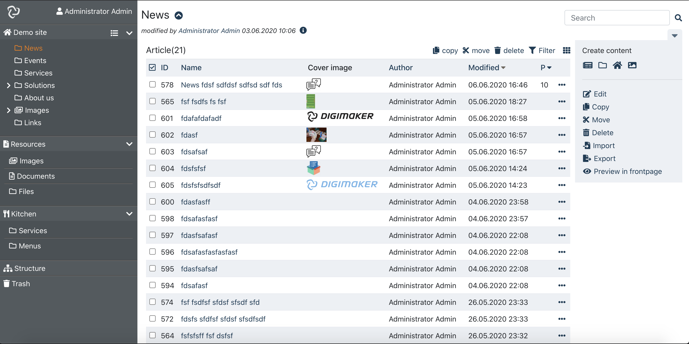
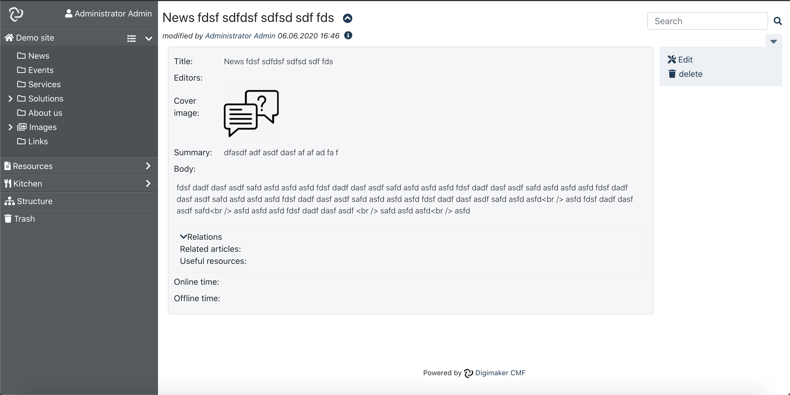
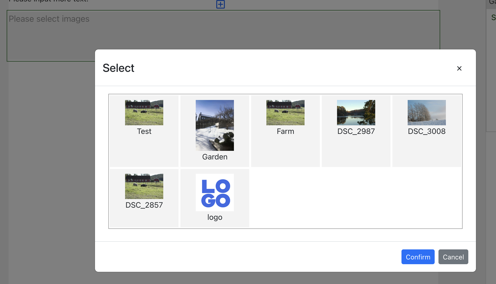

# digimaker-ui

digimaker-ui is the ui components for Digimaker CMF, developed in React. It provides client features like create, edit, delete, actions and other editorial features.

Documentation: [https://digimaker.org/doc/digimaker-ui](https://digimaker.org/doc/digimaker-ui)

Components
---
- List(include block view)
- Main(for building main page for admin site)
- TreeNode
- Browse
- Util. eg. FileUpload
- Views: content view, version view
- Actions: create, edit, delete, filter, move, copy, set to top, set priority, assign/unassign role, disable user

Building admin
----

Use in app
----
Browsing:

